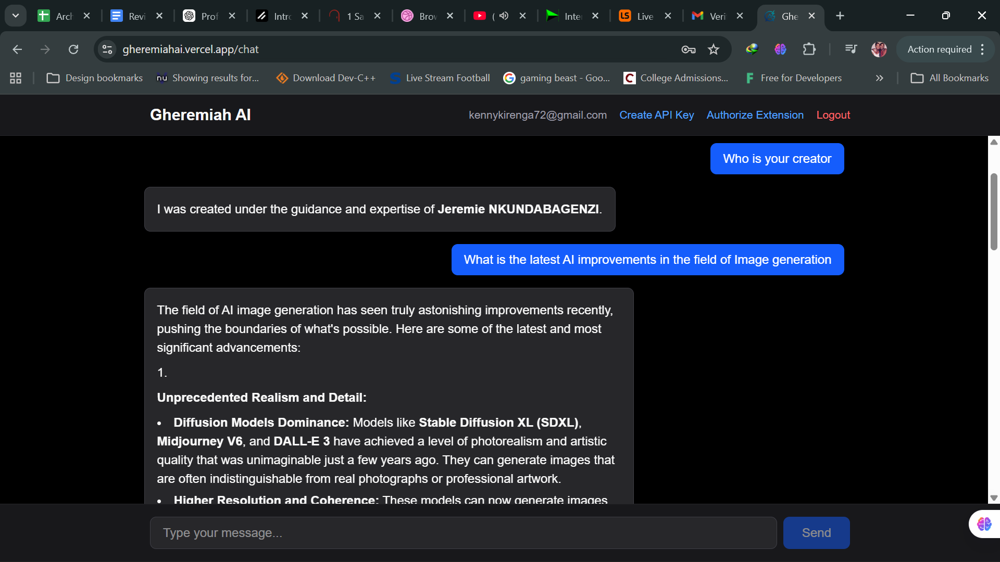

# Gheremiah AI

A comprehensive AI-powered assistant platform built with multiple interfaces — web application, backend API, VS Code extension, and Slackbot. All powered by Google's Gemini AI models.

## About This Project

Gheremiah AI was created as a study project to learn full-stack development, AI integration, and building multi-platform applications. It demonstrates building a complete AI assistant ecosystem with authentication, real-time streaming, and seamless integration across different platforms.

## Products

This project consists of four main products:

### 1. **Gheremiah AI Backend** 🚀
Express.js API server with MongoDB, handling user authentication, AI chat integration, and API key management.

- [View Backend README](./GheremiahAIBackend/README.md)
- **Tech Stack**: Node.js, Express, MongoDB, TypeScript, JWT, Google Gemini API
- **Deployment**: Render

### 2. **Gheremiah AI Web Platform** 💻
Modern Next.js web application with a clean, responsive interface for chatting with the AI.

- [View Frontend README](./gheremiahaifrontend/README.md)
- **Tech Stack**: Next.js 16, TypeScript, Tailwind CSS, Vercel AI SDK
- **Deployment**: Vercel



### 3. **Gheremiah AI VS Code Extension** 🛠️
VS Code extension that brings AI assistance directly into your editor with a custom webview interface.

- [View Extension README](./GheremiahAIExtension/README.md)
- **Tech Stack**: TypeScript, VS Code API, Webview Panels, Marked.js, Highlight.js
- **Installation**: Manual from VSIX

[](./ProofOfConcepts/Extension.mp4)

### 4. **Gheremiah AI - Slackbot** 💬
Slack bot that brings Gheremiah AI to your workspace with slash commands and direct messaging.

- [View Slackbot README](./GheremiahRiddler/README.md)
- **Tech Stack**: Node.js, TypeScript, Slack Bolt SDK, Google Gemini API
- **Deployment**: Railway

[](./ProofOfConcepts/slackbot.mp4)

## Architecture

```
GheremiahAI/
├── GheremiahAIBackend/       # Express.js API server (MongoDB + Gemini)
├── gheremiahaifrontend/      # Next.js web app
├── GheremiahAIExtension/     # VS Code extension
├── GheremiahRiddler/         # Slackbot (Node.js)
├── shared/                   # Shared types & utilities
└── ProofOfConcepts/          # Demo images and videos
```

## Quick Start

### Prerequisites
- Node.js >= 18
- MongoDB running locally or via Atlas
- Google Gemini API key

### Setup

```bash
# Install all dependencies
npm install

# Build shared package first
npm run build:shared

# Copy env files
cp GheremiahAIBackend/.env.example GheremiahAIBackend/.env
cp GheremiahRiddler/.env.example GheremiahRiddler/.env
```

### Environment Variables

**Backend** (`GheremiahAIBackend/.env`):
- `MONGODB_URI` — MongoDB connection string
- `GOOGLE_API_KEY` — Gemini API key
- `JWT_SECRET` — Secret for JWT tokens
- `PORT` — Server port (default: 8000)

**Frontend** (`gheremiahaifrontend/.env.local`):
- `NEXT_PUBLIC_BACKEND_URL` — Backend API URL

**Slackbot** (`GheremiahRiddler/.env`):
- `SLACK_BOT_TOKEN` — Slack bot token (xoxb-...)
- `SLACK_APP_TOKEN` — Slack app token (xapp-...)
- `GEMINI_API_KEY` — Gemini API key
- `BACKEND_URL` — Backend API URL

**Extension** (`GheremiahAIExtension/.env`):
- `BACKEND_URL` — Backend API URL
- `FRONTEND_URL` — Frontend URL (for OAuth)
- `GEMINI_API_KEY` — Gemini API key

### Run

```bash
# Start backend + frontend concurrently
npm run dev

# Start backend only
npm run dev:backend

# Start frontend only
npm run dev:frontend

# Start Slackbot
npm run dev --workspace=@gheremiah-ai/riddler

# Build and run VS Code extension (see extension README for details)
cd GheremiahAIExtension
npm run compile
```

## API Endpoints

| Endpoint | Description |
|---|---|
| `GET /health` | Health check |
| `POST /api/auth/register` | Register user |
| `POST /api/auth/login` | Login user |
| `POST /api/chat` | Chat with Gemini (supports streaming) |
| `GET /api/keys` | List API keys |
| `POST /api/keys` | Create API key |
| `DELETE /api/keys/:id` | Delete API key |

### Chat API Usage

```bash
# With JWT token
curl -X POST http://localhost:8000/api/chat \
  -H "Authorization: Bearer <token>" \
  -H "Content-Type: application/json" \
  -d '{"messages":[{"role":"user","content":"Hello"}]}'

# With API key
curl -X POST http://localhost:8000/api/chat \
  -H "x-api-key: gai_xxx" \
  -H "Content-Type: application/json" \
  -d '{"messages":[{"role":"user","content":"Hello"}]}'
```

## Key Features Across Products

- **Real-time Streaming**: All products support streaming AI responses for instant feedback
- **Authentication**: Secure JWT-based authentication across all platforms
- **Markdown Rendering**: Rich text formatting with syntax highlighting for code
- **Subscription Tiers**: Free and premium tiers with different token limits
- **Custom System Prompts**: Default AI personality with override capability

## Deployment

- **Backend**: Deployed on [Render](https://render.com)
- **Frontend**: Deployed on [Vercel](https://vercel.com)
- **Slackbot**: Deployed on [Railway](https://railway.com)
- **Extension**: Manual installation from VSIX file

## Proof of Concepts

Demo media files are available in the `ProofOfConcepts/` directory:

- `web_platform.png` - Screenshot of the web platform interface
- `Extension.mp4` - Screen recording of the VS Code extension
- `slackbot.mp4` - Screen recording of the Slackbot in action

## Individual Product Documentation

For detailed setup instructions, usage guides, and troubleshooting for each product, please refer to their respective README files:

- [Backend Documentation](./GheremiahAIBackend/README.md)
- [Frontend Documentation](./gheremiahaifrontend/README.md)
- [Extension Documentation](./GheremiahAIExtension/README.md)
- [Slackbot Documentation](./GheremiahRiddler/README.md)

## Key Lessons Learned

Across the development of all products, several important lessons were learned:

1. **Monorepo Management**: Managing multiple packages in a monorepo with shared dependencies and build processes.

2. **TypeScript Configuration**: Understanding module resolution, compilation options, and type safety across different environments.

3. **AI Integration**: Integrating with Google's Gemini API using the Vercel AI SDK with streaming support.

4. **Authentication Flows**: Implementing OAuth, JWT tokens, and secure token storage across different platforms.

5. **Real-time Streaming**: Implementing streaming responses for better user experience in web, extension, and bot contexts.

6. **Deployment Strategies**: Deploying different types of applications (API, web app, bot, extension) to cloud platforms.

7. **Platform-Specific APIs**: Learning platform-specific APIs (VS Code, Slack, Next.js) and their best practices.

## License

ISC

## Author

NKUNDABAGENZI Jeremie
